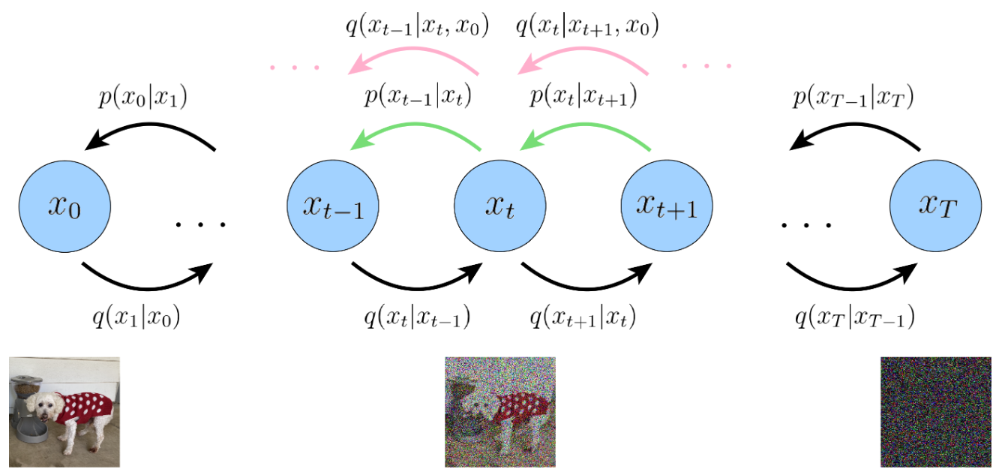
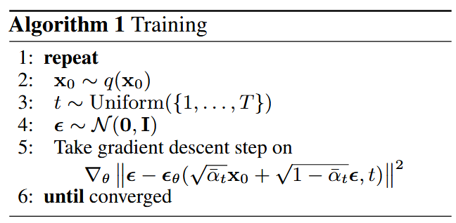
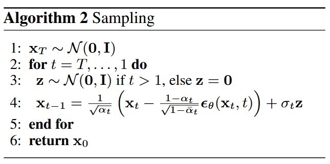

## Denoising Diffusion Probabilistic Models (DDPMs)

目的：从随机噪声（标准正态分布）中生成数据样本（e.g., 一张猫猫的图片）。
$$
z \sim \mathcal{N}(0, I) \longrightarrow x \sim q_{\text{data}}(x)
$$

<div align="center"></div>

---
### 前向过程 Forward Process
很明显，直接从随机噪声中生成一个数据样本是非常困难的。那么如果反过来呢？考虑先把数据样本 $x_0$ 破坏成噪声 $x_T$，这里假设需要 $T$ 时间步。把这个过程用数学表示出来（我们约定前向过程用概率分布 $q$ 来表示）：
$$
x_0 \sim q_{\text{data}} \rightarrow x_1 \rightarrow \cdots \rightarrow x_T \sim \mathcal{N}(0, I)
$$
更具体的，DDPMs将其定义为（已知的）前向加噪过程(Forward Process)，他是一个Markov过程：
$$
q(x_{1:T} \mid x_0) = \prod_{t=1}^{T} q(x_{t} \mid x_{t-1}) \quad \text{with} \quad q(x_{t} \mid x_{t-1}) = \mathcal{N}(x_{t}; \sqrt{1-\beta_t} x_{t-1}, \beta_t I)
$$
其中 $\beta_t$ 也是已知的，预定义好的一个数列，满足 $\beta_1 < \beta_2 < \cdots < \beta_T$，可以是linear schedule, cosine schedule等等...

从转移概率分布 $q(x_{t} \mid x_{t-1})$ 中可以看出，其实这个概率可以等价成一个等式（重参数化 reparameterization）：
$$
x_{t} = \sqrt{1-\beta_t} x_{t-1} + \beta_t \varepsilon_t, \quad \varepsilon_t \sim \mathcal{N}(0, I)
$$
这个等式相比概率分布而言更直观的体现加噪过程：每次在上一步的状态 $x_{t-1}$ 上，与新引入的一个随机噪声 $\varepsilon_t$ 进行线性组合，以此得到下一个时刻的状态 $x_{t}$。
现在来看看这个Markov链有什么很好的性质：任何时刻的 $x_t$ 可以由 $x_0$ 和 $\beta_t$ 表示：
$$
\begin{equation*}
\begin{split}
x_t &= \sqrt{1-\beta_t} x_{t-1} + \sqrt{\beta_t} \varepsilon_t \\
&= \sqrt{\alpha_t} x_{t-1} + \sqrt{1-\alpha_t} \varepsilon_t \\
&= \sqrt{\alpha_t} (\sqrt{\alpha_{t-1}} x_{t-2} + \sqrt{1-\alpha_{t-1}} \epsilon_{t-1}) + \sqrt{1-\alpha_t} \varepsilon_t \\
&= \sqrt{\alpha_t \alpha_{t-1}} x_{t-2} + \sqrt{\alpha_t(1-\alpha_{t-1}) + 1-\alpha_t} \varepsilon_{t-2} \\
&= \sqrt{\alpha_t \alpha_{t-1}} x_{t-2} + \sqrt{1 - \alpha_t\alpha_{t-1}} \varepsilon_{t-2} \\
&= \cdot\cdot\cdot \\
&= \sqrt{\alpha_t \alpha_{t-1}\cdot\cdot\cdot\alpha_1} x_0 + \sqrt{1 - \alpha_t\alpha_{t-1}\cdot\cdot\cdot\alpha_1} \varepsilon\\
&= \sqrt{\bar{\alpha}_t} x_0 + \sqrt{1 - \bar{\alpha}_t} \varepsilon\\
\end{split}
\end{equation*}
$$
这里我们简记 $\alpha_t = 1 - \beta_t$ 和 $\bar{\alpha}_t = \prod_{i=1}^t \alpha_i$，并且对随机噪声的合并中用到了正态分布的性质：$\mathcal{N}(\mu_1, \sigma_1^2 I) + \mathcal{N}(\mu_2, \sigma_2^2 I) = \mathcal{N}(\mu_1+\mu_2, (\sigma_1^2 + \sigma_2^2)I)$。如果再用概率来表示 $x_t$ 和 $x_0$ 之间的关系 $x_t = \sqrt{\bar{\alpha}_t} x_0 + \sqrt{1 - \bar{\alpha}_t} \varepsilon$，也就是下面这个条件概率：

$$
q(x_t \mid x_0) = \mathcal{N} (x_t; \sqrt{\bar{\alpha}_t} x_0, (1 - \bar{\alpha}_t)I)
$$

---
### 反向过程 Reverse Process
前向过程的性质就先挖到这里，接下来我们来考虑反向过程(Reverse Process)。约定反向过程中的未知概率分布用 $p$ 来表示（与前向过程已知的分布区分），我们希望能够反转上述（前向）过程，如果可以从 $p(x_{t-1} \mid x_t)$ 中采样，那么我们就可以在 $T$ 时刻从随机噪声（标准正态分布）中采样一个初始值 $x_T \sim \mathcal{N}(0, I)$，然后一步步去噪来还原，最终得到一个与真实图像分布（近似）一致的 $\hat{x}_0$。

但是我们并没有 $p(x_{t-1} \mid x_t)$ 的具体表达式，所以我们设计神经网络(Neural Network)来学习这个分布。

定义：$p_{\theta}(x_{t-1} \mid x_t) = \mathcal{N} (x_{t-1}; \mu_{\theta}(x_t, t), \Sigma_{\theta}(x_t, t)I)$，也即均值和方差分别为 $\mu_{\theta}(x_t, t)$ 和 $\Sigma_{\theta}(x_t, t)$ 这两个神经网络项。

我们先考虑如何设计Training Loss：DDPMs选择的是优化负对数似然(negative log-likelihood)，先上结论:
$$
\begin{aligned}
-\log p_\theta(x_0) & \leq\mathbb{E}_{q(x_{1:T} |x_0)}\left[-\log\frac{p_\theta(x_{0:T})}{q(x_{1:T}|x_0)}\right] \\
&= \mathbb{E}_{q(x_{1:T}|x_0)}{\left[\underbrace{D_{\mathrm{KL}}(q(x_{T}|x_{0})\|p(x_{T}))}_{L_{T}}+\sum_{t=2}^{T}\underbrace{D_{\mathrm{KL}}(q(x_{t-1}|x_{t},x_{0})\|p_{\theta}(x_{t-1}|x_{t}))}_{L_{t-1}}+\underbrace{\log p_{\theta}(x_{0}|x_{1})}_{L_{0}}\right]} \\
&\triangleq \mathcal{L}
\end{aligned}
$$
接下来一点点来推导：
1. ELBO: $-\log p_\theta(x_0) \leq \mathbb{E}_{q(x_{1:T} |x_0)}\left[-\log\frac{p_\theta(x_{0:T})}{q(x_{1:T}|x_0)}\right]$
$$
\begin{aligned}
\log p_\theta(x_0) &= \log \int p_\theta(x_{0:T})dx_{1:T} \\
&= \log \int \frac{p_\theta(x_{0:T}) q(x_{1:T} | x_0)}{q(x_{1:T} | x_0)}dx_{1:T} \\
&= \log \mathbb{E}_{q(x_{1:T} | x_0)} \left[\frac{p_\theta(x_{0:T})}{q(x_{1:T} | x_0)}\right] \\
&\ge \mathbb{E}_{q(x_{1:T} | x_0)} \left[\log \frac{p_\theta(x_{0:T})}{q(x_{1:T} | x_0)}\right] \quad \text{Jensen's Inequality} \\
\end{aligned}
$$
2. $\mathbb{E}_{q(x_{1:T} |x_0)}\left[\log\frac{p_\theta(x_{0:T})}{q(x_{1:T}|x_0)}\right] = \mathbb{E}_{q(x_{1:T} |x_0)}\left[L_{T}+\sum_{t=1}^{T-1}L_{t}+L_{0}\right]$
$$
\begin{aligned}
& \quad \ \mathbb{E}_{q(x_{1:T} |x_0)}\left[\log\frac{p_\theta(x_{0:T})}{q(x_{1:T}|x_0)}\right] \\
&= \mathbb{E}_{q(x_{1:T} |x_0)}\left[\log\frac{p_\theta(x_{T})\prod_{i=1}^{T}p_\theta(x_{t-1}|x_t)}{\prod_{t=1}^{T}q(x_t|x_{t-1})}\right] \\
&= \mathbb{E}_{q(x_{1:T} |x_0)}\left[\log\frac{p(x_{T}) p_\theta(x_0|x_1)\prod_{t=2}^{T}p_\theta(x_{t-1}|x_t)}{q(x_1|x_0)\prod_{t=2}^{T}q(x_t|x_{t-1})}\right] \\
&= \mathbb{E}_{q(x_{1:T} |x_0)}\left[\log\frac{p(x_{T}) p_\theta(x_0|x_1)\prod_{t=2}^{T}p_\theta(x_{t-1}|x_t)}{q(x_1|x_0)\prod_{i=2}^{T}q(x_t|x_{t-1}, x_0)}\right] \\
&= \mathbb{E}_{q(x_{1:T} |x_0)} \left[\log \frac{p(x_{T}) p_\theta(x_0|x_1)}{q(x_1|x_0)} + \log \prod_{t=2}^{T} \frac{p_\theta(x_{i-1}|x_t)}{q(x_t|x_{t-1}, x_0)} \right] \\
&= \mathbb{E}_{q(x_{1:T} |x_0)} \left[\log \frac{p(x_{T}) p_\theta(x_0|x_1)}{q(x_1|x_0)} + \log \prod_{t=2}^{T} \frac{p_\theta(x_{t-1}|x_t)}{\frac{q(x_{t-1}|x_{t}, x_0)q(x_{t}| x_0)}{q(x_{t-1}| x_0)}} \right] \\
&= \mathbb{E}_{q(x_{1:T} |x_0)} \left[\log \frac{p(x_{T}) p_\theta(x_0|x_1)}{q(x_T|x_0)} + \log \prod_{t=2}^{T} \frac{p_\theta(x_{t-1}|x_t)}{q(x_{t-1}|x_{t}, x_0)} \right] \\
&= \mathbb{E}_{q(x_{1:T}|x_0)}\left[D_{\mathrm{KL}}(q(x_{T}|x_{0})\parallel p(x_{T}))+\sum_{t=2}^{T}D_{\mathrm{KL}}(q(x_{t-1}|x_{t},x_{0})\parallel p_{\theta}(x_{t-1}|x_{t}))+\log p_{\theta}(x_{0}|x_{1})\right] \\
&= \mathbb{E}_{q(x_{1:T}|x_0)}\left[L_{T}+\sum_{t=1}^{T-1}L_{t}+L_{0}\right]
\end{aligned}
$$

由此，我们把负对数似然的上界(upper bound)求出来了，原来的负对数似然只是对反向过程中神经网络的概率分布 $p_\theta$ 的建模，通过这个upper bound建立了 $p_\theta$ 与前向过程已知的分布 $q$ 之间的联系。我们把这个upper bound设为最终的Training loss $\mathcal{L}$ 。

可以看到，在推导的时候，我们把拆开的各个部分分别命名为 $L_0$, $L_T$ 和 $L_{i-1}$。现在我们对他们进行单独分析：

#### 最后一项 $L_T$ 
对Training loss $\mathcal{L}$ 来说是个常数（因为我们已知 $p_\theta(x_T) = p(x_T)$ 这个反向过程的起始分布就是标准正态分布）

#### 第一项 $L_0$ 

这一项在DDPM的实现中是通过高斯离散编码器(independent discrete decoder)实现的，这一块晚点来补充具体实现。
```py
# === Log likelihood calculation ===
def _vb_terms_bpd(self, denoise_fn, x_start, x_t, t, *, clip_denoised: bool, return_pred_xstart: bool):
	true_mean, _, true_log_variance_clipped = self.q_posterior_mean_variance(x_start=x_start, x_t=x_t, t=t)
	model_mean, _, model_log_variance, pred_xstart = self.p_mean_variance(
		denoise_fn, x=x_t, t=t, clip_denoised=clip_denoised, return_pred_xstart=True)
	kl = normal_kl(true_mean, true_log_variance_clipped, model_mean, model_log_variance)
	kl = nn.meanflat(kl) / np.log(2.)

	decoder_nll = -utils.discretized_gaussian_log_likelihood(
		x_start, means=model_mean, log_scales=0.5 * model_log_variance)
	assert decoder_nll.shape == x_start.shape
	decoder_nll = nn.meanflat(decoder_nll) / np.log(2.)

	# At the first timestep return the decoder NLL, otherwise return KL(q(x_{t-1}|x_t,x_0) || p(x_{t-1}|x_t))
	assert kl.shape == decoder_nll.shape == t.shape == [x_start.shape[0]]
	output = tf.where(tf.equal(t, 0), decoder_nll, kl)
	return (output, pred_xstart) if return_pred_xstart else output
```

为什么要这么做呢？模型经过 $T − 1$ 步去噪后，在最后一步预测的是一个连续的高斯分布 $\mathcal{N}(x_0;\mu_\theta(x_1,1),\sigma_1^2)$，其均值 $\mu_\theta(x_1,1)$ 是一个在 $[−1,1]$ 区间内的连续值（从连续区间内选定的值）。然而，实际的图像空间却是离散的，对于一个连续的概率分布，任何单个离散点的概率都为零，这就会让Loss出现问题。因此，DDPMs设计了这个编码器，把 $p_{\theta}(x_{0}|x_{1})$ 定义为如下表达式：

$$
p_\theta(x_0|x_1)=\prod_{i=1}^D\int_{\delta_-(x_0^i)}^{\delta_+(x_0^i)}\mathcal{N}(x;\mu_\theta^i(x_1,1),\sigma_1^2)dx
$$

$$
\delta_+(x)=\left\{
\begin{array}
{cc}\infty & \mathrm{if}\ x=1 \\
x+\frac{1}{255} & \mathrm{if} \ x<1
\end{array}\right.
$$

$$
\delta_-(x)=\left\{
\begin{array}
{cc}-\infty & \mathrm{if}\ x=1 \\
x-\frac{1}{255} & \mathrm{if}\ x<1
\end{array}\right.
$$

这里 $D$ 是数据维度，$i$ 是像素点索引。上式的核心思想是：计算模型预测的连续高斯分布落在这个离散值所代表的区间内的概率。具体解析一下的话：

+ $\prod_{i=1}^D$: 假设像素之间互相独立，整张图像的概率是就是每个像素 $i$ 的概率的连乘积。
+ $\int_{\delta_-(x_0^i)}^{\delta_+(x_0^i)}\mathcal{N}(x;\mu_\theta^i(x_1,1),\sigma_1^2)dx$: 对于第 $i$ 个像素，其真实的离散值是 $x_0^i \in [-1,1]$。我们通过对模型预测的一维高斯分布 $\mathcal{N}(x;\mu_\theta^i(x_1,1),\sigma_1^2)$ 在一个小的区间 $[\delta_-(x_0^i), \delta_+(x_0^i)]$ 上进行积分，来得到这个离散值的概率。
+ $\delta$ 函数定义的区间：
    + 对于中间值（例如，1到254的像素值）：每个离散值代表一个宽度为 $\frac{2}{255}$ 的区间。例如，对于缩放后的值 $x_0^i$，其区间是 $[x_0^i − \frac{1}{255}, x_0^i + \frac{1}{255}]$
    + 对于边界值 (0或255)：
        + 如果是像素值255（缩放后为1），我们计算高斯分布落在 $[1-\frac{1}{255}, +\infty)$ 这个区间的概率。
        + 如果是像素值0（缩放后为-1），我们计算高斯分布落在 $[-\infty, -1+\frac{1}{255})$ 这个区间的概率。

这个过程确保了整个连续高斯分布的概率被完整地分配给了256个离散的像素值。

实际计算中，可以用高斯概率密度函数乘以区间宽度近似这个积分。


#### 中间的 $T-1$ 项 $L_t$  ($1 \le t \le T-1$)

我们先考虑 $q(x_{t-1}|x_{t},x_{0})$ 这个概率分布，因为这是一个确定的分布，根据贝叶斯(Bayes)定理和前向过程定义的概率：
$$
\begin{aligned}
q(x_{t-1}|x_{t},x_{0}) &= \frac{q(x_{t-1},x_{t},x_{0})}{q(x_{t},x_{0})} \\
&= \frac{q(x_{0},x_{t-1}) q(x_{t}|x_{0},x_{t-1})}{q(x_{0})q(x_{0}|x_{t})} \\
&= \frac{q(x_{0}) q(x_{t-1}|x_{0}) q(x_{t}|x_{0},x_{t-1})}{q(x_{0})q(x_{t}|x_{0})} \\
&= \frac{q(x_{t-1}|x_{0}) q(x_{t}|x_{0},x_{t-1})}{q(x_{t}|x_{0})} \\
&= \frac{q(x_{t-1}|x_{0}) q(x_{t}|x_{t-1})}{q(x_{t}|x_{0})} \\
&= \frac{\mathcal{N} (\sqrt{\bar{\alpha}_{t-1}} x_0, (1 - \bar{\alpha}_{t-1})I)\cdot\mathcal{N}(\sqrt{1-\beta_t} x_{t-1}, \beta_t I)}{\mathcal{N} (\sqrt{\bar{\alpha}_t} x_0, (1 - \bar{\alpha}_t)I)}
\end{aligned}
$$
计算这种正态分布乘积除法的混合运算时，已知最后运算结束还是服从正态分布，所以可以直接考虑 $e$ 指数的部分（先省略其他的常数部分 e.g. $\frac{1}{\sqrt{2\pi}\sigma}$），以减轻计算量（这里指数部分展开后的合并化简策略大概是这样的：最终要计算 $q(x_{t-1}|x_{t},x_{0})$ ，我们把其中的 $x_{t-1}$ 当成主元（未知数），条件中的 $x_{t}$ 和 $x_{0}$ 作为已知的进行计算）：
$$
\begin{aligned}
& \quad \frac{\mathcal{N} (\sqrt{\bar{\alpha}_{t-1}} x_0, (1 - \bar{\alpha}_{t-1})I)\cdot\mathcal{N}(\sqrt{1-\beta_t} x_{t-1}, \beta_t I)}{\mathcal{N} (\sqrt{\bar{\alpha}_t} x_0, (1 - \bar{\alpha}_t)I)} \\
&\propto \exp \left[ -\frac{1}{2} \left( \frac{(x_t - \sqrt{\alpha_t} x_{t-1})^2}{\beta_t} + \frac{(x_{t-1} - \sqrt{\bar{\alpha}_{t-1}} x_{0})^2}{1 - \bar{\alpha}_{t-1}} - \frac{(x_{t} - \sqrt{\bar{\alpha}_{t}} x_{0})^2}{\bar{\alpha}_{t}} \right) \right]  \\
&\propto \exp \left\{ -\frac{1}{2\frac{\beta_t(1-\bar{\alpha}_{t-1})}{1-\bar{\alpha}_t}}\left[x_{t-1}^2-2\frac{\sqrt{\alpha_t}(1-\bar{\alpha}_{t-1})x_t+\sqrt{\bar{\alpha}_{t-1}}\beta_t x_0}{1-\bar{\alpha}_t}x_{t-1}\right] \right\} \\
&\propto \exp \left\{ -\frac{1}{2\frac{\beta_t(1-\bar{\alpha}_{t-1})}{1-\bar{\alpha}_t}}\left(x_{t-1}-\frac{\sqrt{\alpha_t}(1-\bar{\alpha}_{t-1})x_t+\sqrt{\bar{\alpha}_{t-1}}\beta_t x_0}{1-\bar{\alpha}_t}\right)^2 \right\} 
\end{aligned}
$$
对比正态分布的概率密度表达式就可以得到：
$$
\begin{gathered}
q(x_{t-1}|x_{t},x_{0}) \sim \mathcal{N}(\mu_q, \Sigma^2_q I), \\
\mu_q = \frac{\sqrt{\alpha_t}(1-\bar{\alpha}_{t-1})}{1-\bar{\alpha}_t}x_t+\frac{\sqrt{\bar{\alpha}_{t-1}}\beta_t}{1-\bar{\alpha}_t} x_0, \ \Sigma^2_q = \frac{\beta_t(1-\bar{\alpha}_{t-1})}{1-\bar{\alpha}_t}.
\end{gathered}
$$
先前我们已经求出了 $x_t$ 与 $x_0$ 的关系式，所以这里我们进一步化简 $\mu_q$ 
$$
\begin{aligned}
\mu_q &= \frac{\sqrt{\alpha_t}(1-\bar{\alpha}_{t-1})}{1-\bar{\alpha}_t}x_t+\frac{\sqrt{\bar{\alpha}_{t-1}}\beta_t}{1-\bar{\alpha}_t} x_0  \\
&= \frac{\sqrt{\alpha_t}(1-\bar{\alpha}_{t-1})}{1-\bar{\alpha}_t}x_t+\frac{\sqrt{\bar{\alpha}_{t-1}}\beta_t}{1-\bar{\alpha}_t} \frac{1}{\sqrt{\bar{\alpha}_{t}}}(x_t - \sqrt{1-\bar{\alpha}_{t}}\varepsilon_t) \\
&= \frac{\sqrt{\alpha_t}(1-\bar{\alpha}_{t-1})}{1-\bar{\alpha}_t}x_t+\frac{\beta_t}{(1-\bar{\alpha}_t)\sqrt{\alpha_t}} (x_t - \sqrt{1-\bar{\alpha}_{t}}\varepsilon_t) \\
&= \left( \frac{\sqrt{\alpha_t}(1-\bar{\alpha}_{t-1})}{1-\bar{\alpha}_t} + \frac{\beta_t}{(1-\bar{\alpha}_t)\sqrt{\alpha_t}} \right) x_t - \frac{\beta_t}{\sqrt{1-\bar{\alpha}_{t}}\sqrt{\alpha_t}} \varepsilon_t \\
&= \left( \frac{\alpha_t(1-\bar{\alpha}_{t-1}) + \beta_t}{(1-\bar{\alpha}_t)\sqrt{\alpha_t}} \right) x_t - \frac{\beta_t}{\sqrt{1-\bar{\alpha}_{t}}\sqrt{\alpha_t}} \varepsilon_t \\
&= \left( \frac{1-\alpha_t\bar{\alpha}_{t-1}}{(1-\bar{\alpha}_t)\sqrt{\alpha_t}} \right) x_t - \frac{\beta_t}{\sqrt{1-\bar{\alpha}_{t}}\sqrt{\alpha_t}} \varepsilon_t \\
&= \frac{1}{\sqrt{\alpha_t}} x_t - \frac{1 - \alpha_t}{\sqrt{1-\bar{\alpha}_{t}}\sqrt{\alpha_t}} \varepsilon_t \\
&= \frac{1}{\sqrt{\alpha_t}} \left( x_t - \frac{1 - \alpha_t}{\sqrt{1-\bar{\alpha}_{t}}} \varepsilon_t \right)
\end{aligned}
$$
对于方差 $\Sigma_q^2$ ，他只与我们预设的超参数 $\beta_t$ 有关。

对于两个正态分布的KL散度 (KL Divergence) (assume $d$ is the dimension)：
$$
D_{\text{KL}} \left( \mathcal{N} (x; \mu_x, \Sigma_x) \parallel \mathcal{N} (y; \mu_y, \Sigma_y) \right) = \frac{1}{2} \left[ \log\frac{|\Sigma_y|}{|\Sigma_x|} - d + \text{tr}(\Sigma_y^{-1}\Sigma_x) + (\mu_y - \mu_x)^T \Sigma_y^{-1} (\mu_y - \mu_x) \right]
$$

于是为了简便计算 $D_{\text{KL}} \left( q(x_{t-1}|x_{t},x_{0}) || p_{\theta}(x_{t-1}|x_{t}) \right)$，DDPMs就直接把 $p_{\theta}(x_{i-1}|x_{i})$ 的方差 $\Sigma_{\theta}(x_t, t)$ 设置成与 $q(x_{t-1}|x_{t},x_{0})$ 的方差相同 $\Sigma^2_{\theta}(x_t, t) = \beta_t(1-\bar{\alpha}_{t-1})/(1-\bar{\alpha}_t)$。

此时，$L_t$ 就变为

$$
\begin{aligned}
L_t &= D_{\text{KL}}(q(x_{t-1}|x_{t},x_{0}) \parallel p_{\theta}(x_{t-1}|x_{t})) \\
&= \frac{1}{2} \left[ \log\frac{|\Sigma_q|}{|\Sigma_q|} - d + \text{tr}(\Sigma_q^{-1}\Sigma_q) + (\mu_\theta - \mu_q)^T \Sigma_q^{-1} (\mu_\theta - \mu_q) \right] \\
&= \frac{1}{2} \left[ - d + d + (\mu_\theta - \mu_q)^T \left(\frac{\beta_t(1-\bar{\alpha}_{t-1})}{1-\bar{\alpha}_t}I\right)^{-1} (\mu_\theta - \mu_q) \right] \\
&= \frac{1}{2\sigma_t^2} \| \mu_q(x_t, t) - \mu_\theta(x_t, t) \|^2 
\end{aligned}
$$
这里简记 $\sigma_t^2 \triangleq \frac{\beta_t(1-\bar{\alpha}_{t-1})}{1-\bar{\alpha}_t}$。这时就能发现，其实最终的loss就是两个均值之间的norm平方。

再进一步的，我们前面化简过 $\mu_q$ 了，代入 $L_i$ 中后，
$$
\frac{1}{2\sigma_i^2} \| \mu_q(x_t, t) - \mu_\theta(x_t, t) \|^2 = \frac{1}{2\sigma_i^2} \bigg\| \frac{1}{\sqrt{\alpha_t}} \left( x_t - \frac{1 - \alpha_t}{\sqrt{1-\bar{\alpha}_{t}}} \varepsilon_t \right) - \mu_\theta(x_t, t) \bigg\|^2 
$$
此时神经网络项 $\mu_\theta(x_t, t)$ 是需要有 $x_t$ 作为输入的（即我们已知 $x_t$ ），这时候如果我们做一个巧妙的参数化（目的是为了进一步简化这个loss的形式）:

$$
\mu_\theta(x_t, t) = \frac{1}{\sqrt{\alpha_t}} \left( x_t - \frac{1 - \alpha_t}{\sqrt{1-\bar{\alpha}_{t}}} \varepsilon_\theta(x_t, t) \right)
$$
也就是将参数 $\theta$ 从均值 $\mu_\theta$ 转换到噪声 $\varepsilon_\theta$ 上，由此可以消去norm中的 $x_t$ 部分，此时 $L_t$ 进一步化简为：

$$
\frac{1}{2\sigma_t^2} \| \mu_q(x_t, t) - \mu_\theta(x_t, t) \|^2 = \frac{1}{2\sigma_t^2} \frac{1 - \alpha_t}{\sqrt{\alpha_t}\sqrt{1-\bar{\alpha}_{t}}} \| \varepsilon_\theta(x_t, t) - \varepsilon_t \|^2 
$$
norm前面的常数倍数其实是可以忽略的（常数倍数对Loss没有影响），所以最终DDPMs就是训练一个噪声神经网络 $\varepsilon_\theta(x_t, t)$ （输入是当前时刻 $t$ 和一张带有噪声的图片 $x_t$ ）去拟合当前时刻前向过程引入的噪声。


最终的Loss $\mathcal{L}$ 就变成了：

$$
\mathcal{L} = \mathbb{E}_{t, x_0, \varepsilon} \left[ \| \varepsilon_\theta(\sqrt{\bar{\alpha}_t} x_0 + \sqrt{1 - \bar{\alpha}_t} \varepsilon, t) - \varepsilon \|^2 \right]
$$
其中 $t \sim U(1, T)$。$t=1$ 的情况对应于$L_0$，就是离散解码器的情况，$t>1$ 的情况就是刚刚推导的 $L_t$。正如前面所说的，$L_T$ 与神经网络参数 $\theta$ 无关，所以就没有出现。


#### 训练算法 Training Algorithm
用伪代码来总结一下整个的训练流程：
1. 从数据(Ground Truth)训练集中随机选取一个数据 $x_0$。
2. 从1到 $T$ 中随机选取一个时间步 $t$。
3. 从标准正态分布中随机选取一个噪声 $\varepsilon$，计算这个时间步下的 $x_t$。
4. 把 $x_t$ 和 $t$ 输入神经网络并返回预测的噪声 $\varepsilon_\theta$。
5. 计算Loss $\mathcal{L}$并对 $\theta$ 进行梯度下降进行优化，直到收敛。

<div align="center"></div>


#### 采样算法 Sampling/Inference Algorithm

假设我们已经获得了训练好的噪声神经网络 $\varepsilon_\theta(x_t, t)$ ，接下来我们来分析采样/推理（sampling/inference）过程。

这里就比较简单了，因为我们已有 $\varepsilon_\theta(x_t, t)$，所以可以通过我们先前建模的概率分布 $p_\theta(x_{t-1} | x_t)$ 来进行采样/推理，从随机噪声 $x_T \sim \mathcal{N}(0, I)$ 开始生成一张图像。具体来说：

$$
\begin{aligned}
& \ p_\theta(x_{t-1} | x_t) = \mathcal{N} \left(\frac{1}{\sqrt{\alpha_t}} \left( x_t - \frac{1 - \alpha_t}{\sqrt{1-\bar{\alpha}_{t}}} \varepsilon_\theta(x_t, t) \right), \frac{\beta_t(1-\bar{\alpha}_{t-1})}{1-\bar{\alpha}_t} I\right) \\
\Leftrightarrow \ & x_{t-1} = \frac{1}{\sqrt{\alpha_t}} \left( x_t - \frac{1 - \alpha_t}{\sqrt{1-\bar{\alpha}_{t}}} \varepsilon_\theta(x_t, t) \right) + \frac{\beta_t(1-\bar{\alpha}_{t-1})}{1-\bar{\alpha}_t} \varepsilon
\end{aligned}
$$

所以在有当前时间步下的 $x_t$，就可以根据上述公式往前递推一步。用伪代码来总结一下整个的采样/推理流程：
1. 从随机噪声中采样 $x_T \sim \mathcal{N}(0, I)$。
2. 从随机噪声中采样 $z \sim \mathcal{N}(0, I)$。当 $t=1$ 也就是采样的最后一步生成 $\hat{x}_0$ 时，就不需要添加噪声了（这样生成最终的图像时不会引入额外的噪声）。
3. $t$ 到 $t-1$ 往前更新一步：$x_{t-1} = \frac{1}{\sqrt{\alpha_t}} \left( x_t - \frac{1 - \alpha_t}{\sqrt{1-\bar{\alpha}_{t}}} \varepsilon_\theta(x_t, t) \right) + \frac{\beta_t(1-\bar{\alpha}_{t-1})}{1-\bar{\alpha}_t} z$
4. 循环 $T$ 步，最终返回生成的 $\hat{x}_0$。

<div align="center"></div>


需要特别注意的细节是，最后一步要区分训练与生成：
+ 为了计算损失 $L_0$（训练时）：我们使用先前定义的、复杂的积分解码器来计算离散数据的精确对数似然。
+ 为了生成图像（采样时）：我们并不执行前面提到的解码器这个积分过程。我们采用算法的确定性最后一步（上面提到的为了生成最终的图像时不引入额外的噪声），即 $x_0 = \mu_\theta(x_1, 1)$。这个结果是一个连续值（在$[-1, 1]$内），我们直接将其缩放回 $[0, 255]$ 并取整，作为最终的生成图像来显示。这样做是为了获得视觉上最清晰、最平滑的图像。

---

### $\beta_t$ 的选取
现在我们回过头来看 $\beta_t$ 应该如何选取：为了尽可能满足最终 $x_T \sim \mathcal{N}(0, I)$，我们希望 $\sqrt{\bar{\alpha}_T} \approx 0$。DDPMs原文中选取了总步长 $T=1000$，线性的 $\beta_t$ (linear schedule)，满足 $\beta_1 = 10^{-4}$ 和 $\beta_T = 0.02$ 单调递增，（也就是 $\beta_t = 10^{-4} + (t-1) \frac{0.02 - 10^{-4}}{T-1}$），对应的 $\alpha_t$ 就满足 $\alpha_1 = 1-10^{-4}$ 和 $\alpha_T = 1-0.02$ 单调递减（$\alpha_t = 1 - \beta_t$）。简单估算一下 $\bar{\alpha}_t$:

$$
\log \bar{\alpha}_t = \sum_{t=1}^T \log\alpha_t = \sum_{t=1}^T \log(1-\beta_t) < -\sum_{t=1}^T \beta_t = -\frac{\beta_1 +\beta_T}{2} T
$$

代入 $T=1000$, $\beta_1 = 10^{-4}$ 和 $\beta_T = 0.02$，因此，$\sqrt{\bar{\alpha}_t} \approx e^{-5}$ 可以近似于 $0$，所以这样的 $\beta_t$ 是符合标准的。


---
### 代码实现 Code Implementations

emmmm这部分等我什么时候手撕了DDPMs再来更新（恨）

To Be Continued...

---

### 参考文献 Reference

1. **Denoising Diffusion Probabilistic Models.**  [[pdf](https://arxiv.org/pdf/2006.11239)]

2. **Understanding Diffusion Models: A Unified Perspective.**  [[pdf](https://arxiv.org/pdf/2208.11970)]