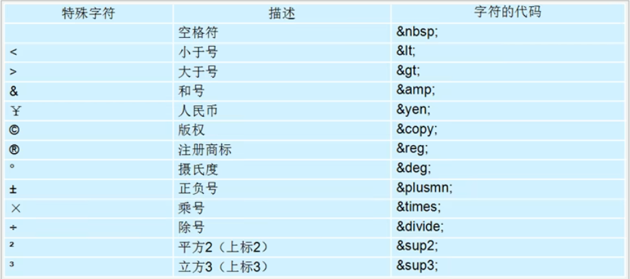
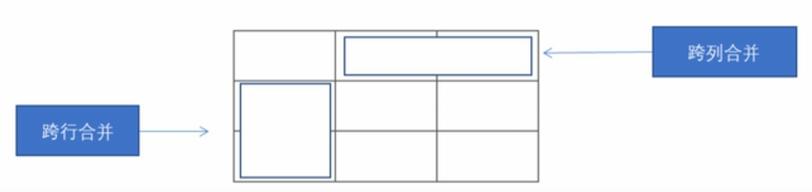

## HTML
### HTML入门
+ HTML(Hyper Text Markup Language): 超文本标记语言，用来描述网页的语言。

+ HTML不是编程语言，是标记语言。

+ 所谓超文本，有2层含义:
    + 可以加入图片、声音动画、多媒体等内容(超越了文本限制)。
    +还可以从一个文件跳转到另一个文件，与世界各地主机的文件连接(超级链接文本)。

+ 浏览器内核（渲染引擎）：负责读取网页内容，整理讯息，计算网页的显示方式并显示页面。

### Web标准的构成
主要包括结构(Structure)、表现(Presentation)和行为(Behavior)三个方面。
+ 结构：结构用于对网页元素进行整理和分类,现阶段主要学的是HTML。
+ 表现：表现用于设置网页元素的版式、颜色、大小等外观样式，主要指的是`css`。
+ 行为：行为是指网页模型的定义及交互的编写，现阶段主要学的是Javascript
+ Web标准提出的最佳体验方案:结构、样式、行为相分离。
    + 结构写到HTML文件中，表现写到`css`文件中，行为写到`JavaScript`文件中。

### 语法
#### 标签关系
并列：
```html
<head>
</head>
<body>
</body>
```

包含：
```html
<head>
    <title> </title>    
</head>
```

### 基本结构
每个网页都会有一个基本的结构标签（也称为骨架标签），页面内容也是在这些基本标签上书写。
+ HTML标签: 页面中最大的标签，我们称为根标签。
```html
<html></html>
```

+ 文档的头部：注意在head标签中我们必须要设置的标签是title。
```html
<head></head>
```

+ 文档的标题：让页面拥有一个属于自己的网页标题。
```html
<title></title>
```

+ 文档的主体：元素包含文档的所有内容，页面内容基本都是放到body里面的。
```html
<body></body>
```

+ `<!DOCTYPE>`标签：文档类型声明，告诉浏览器用哪种HTML版本来显示网页。
    Notice:
    1. `<!DOCTYPE>`声明位于文档中的最前面的位置,处于`<html>`标签之前。
    2. `<!DOCTYPE>`不是一个`HTML`标签。

+ lang 语言种类：用来定义当前文档显示的语言。
    + e.g. English
    ```html
    <html lang="en"></html>
    ```
    + e.g. Chinese
    ```html
    <html lang="zh-CN"></html>
    ```
    其实对于文档显示来说,定义成en的文档也可以显示中文,定义成zh-CN的文档也可以显示英文.
    
    这个属性对浏览器和搜索引擎是有作用的，可以要求翻译。

+ charset 字符集：字符集(Character set)是多个字符的集合，以便计算机能够识别和存储各种文字。

    在`<head>`标签内，可以通过`<meta>`标签的`charset`属性来规定`HTML`文档应该使用哪种字符编码。

    ```html
    <meta charset=" UTF-8" />
    ```

    `charset`常用的值有: GB2312、BIG5、GBK和UTF-8，其中UTF-8也被称为万国码，基本包含了全世界所有国家需要用到的字符。

+ 语义标签：根据标签的语义，在合适的地方给一个最为合理的标签，可以让页面结构更清晰。
    + 标题标签：`HTML`提供了6个等级的网页标题：`<h1>,<h2>,<h3>,<h4>,<h5>,<h6>`。h是`head`的缩写，意为头部、标题。
        ```html
        <h1>一级标题</h1>
        ```
        作为标题使用，依据重要性递减：一级>二级>...
        
        特点:
        1. 加了标题的文字会变的加粗，字号也会依次变大。
        2. 一个标题独占一行。
    + 段落标签：在`HTML`标签中，`<p>`标签用于定义段落，它可以将整个网页分为若干个段落。p是`paragraph`的缩写，意为段落。
        ```html
        <p>段落</p>
        ```

        特点:
        1. 文本在一个段落中会根据浏览器窗口的大小自动换行。
        2. 段落和段落之间保有空隙。


    + 换行标签：在`HTML`中，一个段落中的文字会从左到右依次排列，直到浏览器窗口的右端，然后才自动换行。如果希望某段文本强制换行显示，就需要使用换行标签`<br/>`。br是`break`的缩写，意为打断、换行。
        ```html
        <p>aaaa<br />aaaaaaa</p>
        ```

        特点:
        1. `<br/>`是个单标签。
        2. `<br/>`标签只是简单地开始新的一行，跟段落不一样段落之间会插入一些垂直的间距。

    + 综合案例：
        ```html
        <!DOCTYPE html>
        <html lang="en">
        <head>
            <meta charset="UTF-8">
            <meta name="viewport" content="width=device-width, initial-scale=1.0">
            <title>Document</title>
        </head>
        <body>
            <h1>水花61分伊戈达拉制胜抢断 西决勇士再胜开拓者总分2-0</h1>
            <h4>数据统计:水花兄弟合砍61分</h4>
            <p>库里22投11中，三分14投4中，罚球11罚全中得到37分8篮板8助攻,职业生涯季后赛得分30+次数来到35次,超过哈登
                排名现役第3位，仅次于詹姆斯和杜兰特。</p>

            <p>汤普森22投8中,三分8投4中得到24分3篮板2助攻,德拉蒙德格林得到16分10篮板7助攻5盖帽,凯文-鲁尼得到14分7
            篮板2助攻,今天勇士有7名替补出场。</p>
            <h4>兄弟对决升级:小库里给哥哥造成压力</h4>
            
            <p>库里兄弟是NBA历史上第一对在分区决赛相遇的兄弟。 在西决第1场中,小库里没有给哥哥造成压力,他出场19分钟, 7
            投1中只得到3分3篮板2助攻,在场期间输掉10分。</p>
            <p>但在西决第2场中,小库里攻防两端都打出杰出的表现[全场送出4次抢断,包括直接抢断自己的哥哥库里,在防守端给
            库里造成了极大的困扰。</p>

            <p>作者：<br />2019-8-8</p>

        </body>
        </html>
        ```

    + 文本格式化标签：粗体、斜体、删除线、下划线。突出重要性，比普通文字重要。
        + 加粗：`<strong></strong>`或者`<b></b>`。更推荐使用`<strong>`标签加粗语义更强烈
        + 倾斜：`<em></em>`或者`<i></i>`。更推荐使用`<em>`标签加粗语义更强烈
        + 删除线：`<del></del>`或者`<s></s>`。更推荐使用`<del>`标签加粗语义更强烈
        + 下划线：`<ins></ins>`或者`<u></u>`。更推荐使用`<ins>`标签加粗语义更强烈

        + `<div>`和`<span>`标签：无语义，是一个盒子，用来装内容。
            + 特点:
                1. `<div>`标签用来布局，但是现在一行只能放一个`<div>`。 大盒子
                2. `<span>`标签用来布局，一行上可以多个`<span>`。小盒子
            ```html
            <div>content</div>
            <span>content</span>
            ```

    + 图像标签：在HTML标签中，``标签用于定义HTML页面中的图像。
        ```html
        
        ```
        + `src`是图像标签的**必须属性**，用于指定图像文件的路径和文件名。
        + 图像属性：
            + src：图片路径。必须属性。指定图像文件的路径和文件名。
            + alt：文本。替换文本：图像不能显示的时候显示的文字。
            + title：文本。提示文本：鼠标放到图像上显示的文字。
            + width：像素。设置图像的宽度。
            + height：像素。设置图像的高度。
            + border：像素。设置图像的边框粗细。

        + 特点：
            1. 图像标签可以拥有多个属性，必须写在标签名的后面。
            2. 属性之间不分先后顺序，标签名与属性、属性与属性之间均以空格分开。
            3. 属性采取键值对的格式，即`key="value"`的格式。

    + 超链接标签：`<a>`标签用于定义超链接，作用是从一个页面链接到另一个页面。a为`anchor`的缩写。
        + 链接的语法格式
            ```html
            <a href="跳转目标" target="目标窗口的弹出方式"> 文本或图像 </a>
            ```
            + href(必须属性)：用于指定链接目标的`url`地址，当为标签应用`href`属性时，它就具有了超链接的功能。
            + target：用于指定链接页面的打开方式，其中`_self`为默认值，`_blank`为在新窗口中打开方式。

        + 链接的分类
            + 外部链接
                e.g.
                ```html
                <a href="http://www.baidu.com"> baidu </a>
                ```
            + 内部链接
                e.g.
                ```html
                <a href="index.html"> baidu </a>
                ```

            + 空链接
                e.g.
                ```html
                <a href="#"> baidu </a>
                ```

            + 下载链接：如果`href`里面地址是一个文件或者压缩包(.exe or .zip)，会下载这个文件。
                e.g.
                ```html
                <a href="xxx.zip"> baidu </a>
                ```

            + 网页元素链接：在网页中的各种网页元素，如文本、图像、表格、音频、视频等都可以添加超链接。
                e.g.
                ```html
                <a href="http://www.baidu.com">  </a>
                ```

            + 锚点链接：点击后快速定位到页面中的某个位置
                + 在链接文本的href属性中,设置属性值为`#name`的形式，e.g.
                ```html
                <a href= "#two">第2集</a>
                ```
                + 找到目标位置标签,里面添加一个`id`属性=刚才的`name`，e.g.```html
                <h3 id="two">第2集介绍</h3>
                ```

    + 注释和特殊字符
        + 注释：注释以`<!--`开头，以`-->`结束。
            + 快捷键：`Ctrl + /`
        + 特殊字符
            
            

+ 表格标签
    + 基本语法
    ```html
    <table>
        <tr>
            <td> </td>
            ...
        </tr>  
        ...  
    </table>
    ```

    1. `<table> </table>`是用于定义表格的标签。
    2. `<tr> </tr>`标签用于定义表格中的行，必须嵌套在`<table> </table>`标签中。
    3. `<td> </td>`用于定义表格中的单元格，必须嵌套在`<tr> </tr>`标签中。td为table data缩写，指单元格内容。

    + 表头单元格标签：一般表头单元格位于表格的第一行或第一列，表头单元格里面的文本内容**加粗居中**显示。th为table head缩写。

    ```html
    <table>
        <tr>
            <th> </th>
            ...
        </tr>  
        ...  
    </table>
    ```

    + 表格相关属性：一般通过`css`来设置。
        + `align`：left、center、right。规定表格相对周围元素的对齐方式。
        + `border`：1或""。规定表格单元是否拥有边框，默认为""，表示没有边框
        + `cellpadding`：像素值。规定单元边沿与其内容之间的空白，默认1像素。
        + `cellspacing`：像素值。规定单元格之间的空白，默认2像素。
        + `width`：像素值或百分比。规定表格的宽度。

    + 表格结构标签：在表格标签中分别用: `<thead>`标签表格的头部区域、`<tbody>`标签表格的主体区域这样可以更好的分清表格结构。
        + `<thead> </thead>`：用于定义表格的头部。`<thead>` 内部必须拥有`<tr>`标签。一般是位于第一行。
        + `<tbody> </tbody>`：用于定义表格的主体，主要用于放数据本体。
        + `<thead> </thead>`和`<tbody> </tbody>`都放在`<table> </table>`内。

    + 合并单元格
        + 合并单元格方式：
        1. 跨行合并：`rowspan="合并单元格个数"`。最上侧单元格为目标单元格，在此单元格中写合并代码。
        2. 跨列合并：`colspan="合并单元格个数"`。最左侧单元格为目标单元格，在此单元格中写合并代码。
        
        + 操作步骤：
        1. 确定跨行还是跨列
        2. 找到目标单元格，加入属性`合并方式="合并单元格个数"`
        3. 删除多余的单元格。

+ 列表标签：用来布局，整齐整洁有序，可分三类：无序列表、有序列表、自定义列表。
    + 无序列表：`<ul>`标签表示HTML页面中项目的无序列表，一般会以项目符号呈现列表项，而列表项使用`<li>`标签定义。无序列表的基本语法格式如下:
    ```html
    <ul>
        <li>列表项1</li>
        <li>列表项2</li>
        <li>列表项3</li>
    </ul>
    ```

    1. 无序列表的各个列表项之间没有顺序级别之分，并列的。
    2. `<ul></ul>`只能嵌套`<li></li>`，直接在`<ul></ul>`标签中输入其他标签或者文字的做法也是不被允许的。
    3. `<li></li>`相当于一个容器，里面可以容纳所有元素，放所有的标签。
    4. 无序列表会带有自己的样式属性，但在实际使用时，我们会使用`css`来设置。`


    + 有序列表：`<ol>`标签表示HTML页面中项目的有序列表，列表排序以数字来显示，并且使用`<li>`标签定义列表项。有序列表的基本语法格式如下:
    ```html
    <ol>
        <li>列表项1</li>
        <li>列表项2</li>
        <li>列表项3</li>
    </ol>
    ```

    1. `<ol></ol>`中只能嵌套`<li></li>`，直接在`<ol></ol>`标签中输入其他标签或者文字的做法是不被允许的。
    2. `<li></li>`相当于一个容器，可以容纳所有元素，放所有的标签。
    3. 有序列表会带有自己的样式属性，但在实际使用时，我们会使用`css`来设置。`

    + 自定义列表：自定义列表常用于对术语或名词进行解释和描述，定义列表的列表项前没有任何项目符号。在HTML标签中，`<dl>`标签用于定义描述列表(或定义列表)，该标签会与`<dt> `(定义项目/名字)和`<dd>`(描述每一个项目/名字)一起使用。其基本语法如下:
    ```html
    <dl>
        <dt>名词1</dt>
        <dd>名词1解释1</dd>
        <dd>名词1解释2</dd>
    </dl>
    ```
    1. `<dl></dl>`中只能嵌套`<dt></dt>`和`<dd></dd>`
    2. `<dt></dt>`和`<dd></dd>`个数没有限制，通常一个`<dt>`对应多个`<dd>`。
    3. `<dt>`和`<dd>`里可以容纳所有元素，放所有的标签。

+ 表单标签：用于和用户交互，收集用户信息、用户资料。一个完整的表单由**表单域**、**表单控件**和**提示信息**组成。
    + 表单域；包含表单元素的区域。`<form>`标签用于定义表单域`<form>`会把它范围内的表单元素信息提交给服务器。
    ```html
    <form action="url地址" method="提交方式" name="表单域名称">
        各种表单元素控件
    </form>
    ```
    + 属性
        + action：用于指定接收并处理表单数据的服务器程序的url地址。
        + method：用于设置表单数据的提交方式，其取值为get或post。
        + name：用于指定表单的名称，以区分同一个页面中的多个表单域。

    + 表单元素：允许用户在表单中输入或者选择的内容控件。
        1. **input**输入表单元素：`<input>`标签用于收集用户信息。在`<input>`标签中，包含一个`type`属性，根据不同的`type`属性值，输入字段拥有很多种形式(可以是文本字段、复选框、掩码后的文本控件、单选按钮、按钮等)。`<input />`是**单标签**。

            ```html
            <input type="属性值" />
            ```

            + `type`属性值：
                1. button：定义可点击按钮(多数情况下，用于通过JavaScript启动脚本)，不提交表单域中的数据。
                2. checkbox：定义复选框。
                3. file：定义输入字段和“浏览”按钮，供文件上传。
                4. hidden：定义隐藏的输入字段。
                5. image：定义图像形式的提交按钮。
                6. password：定义密码字段。该字段中的字符被掩码。
                7. radio：定义单选按钮。
                8. reset：定义重置按钮。重置按钮会清除表单中的所有数据，回到默认状态。
                9. submit：定义提交按钮。提交按钮会把表单域中所有表单数据发送到服务器。
                10. text：定义单行的输入字段，用户可在其中输入文本。默认宽度为20个字符。

            + `name`属性：定义input元素的名称。`name`和`value`是每个表单元素都有的属性值，主要给后台人员使用。`name`是表单元素的名字，要求单选按钮和复选框要有相同的name值（radio（或者checkbox）如果是一组，我们必须给他们命名相同的名字）。
            + `value`属性：规定input元素的值。`name`和`value`是每个表单元素都有的属性值，主要给后台人员使用。可以默认显示信息。
            + `checked`属性：`checked="checked"`，规定此input元素首次加载时应当被选中。`checked`属性主要针对单选按钮和复选框，主要作用是一打开界面，就默认选择其中某个表单元素。
            + `maxlength`属性：规定输入字段中的字符的最大长度。`maxlength`是用户可以输入的最多的字符数。

        * `<label>`标签：为`input`元素定义标注(标签)。`<label>`标签用于绑定一个表单元素当点击`<label>`标签内的文本时,浏览器就会自动将焦点（光标）转到或者选择对应的表单元素上，用来增加用户体验。核心：`<label>`中的`for`属性的值和`<input>`中的`id`属性的值相同

        ```html
        <label for="sex">male</label>
        <input type="radio" name="sex" id="sex" />
        ```

        2. **select**下拉表单元素：`<select>`标签定义下拉列表。
            ```html
            <select>
                <option> 选项1 </option>
                <option> 选项2 </option>
                <option> 选项3 </option>
            </select>
            ```
            + `<select>`中至少包含一对`<option>`。
            + 在`<option>`中定义`selected="selected"`时，当前项即为默认选中项。


        3. **textarea**文本域元素：当用户输入内容较多的情况下，我们就不能使用文本框表单了，此时我们可以使用`<textarea>`标签。`<textarea>`标签用于定义多行文本输入的控件。
            ```html
            <textarea rows="3" col="20">默认文本内容</textarea>
            ```
            + 其中两个属性`rows="显示的行数"`和`col="每行中的字符数"`，在实际开发中不会使用，用`css`来调整大小。


+ 表格、列表、表单标签综合案例：<a href="./code/register.html">example</a>

### 参考文献 Reference
1. **w3school 在线教程** [[w3c](https://www.w3school.com.cn/)]